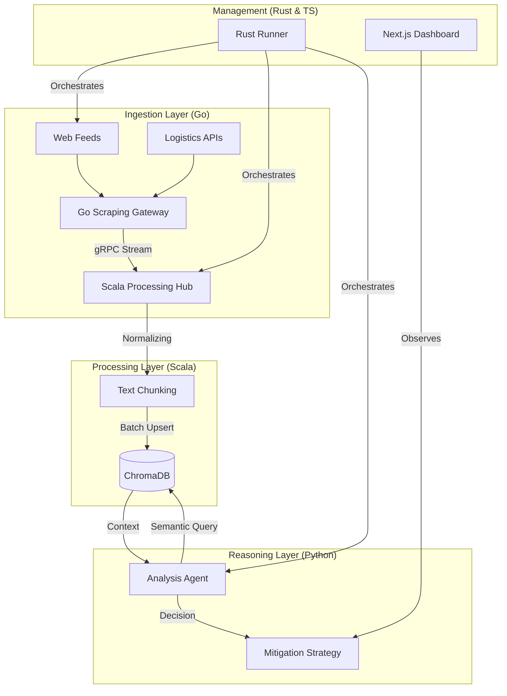

# 🌍 Multi-Agent Supply Chain Risk Intelligence System

[](https://go.dev/)
[](https://www.scala-lang.org/)
[](https://www.python.org/)
[](https://www.rust-lang.org/)

**Multi-Agent Supply Chain Risk Intelligence System** is a polyglot, enterprise-grade AI platform designed to monitor global news, logistics feeds, and supplier data in real-time. It utilizes a resilient RAG (Retrieval-Augmented Generation) pipeline to detect and mitigate supply chain disruptions using specialized agents.

---

## 🏗️ System Architecture

Our system is built on a **High-Resilience Polyglot Pipeline** that ensures zero data loss and independent scaling of intelligence gathering.



---

## 🚀 The Stack: Why Polyglot?

1.  **Go (Ingestion Gateway)**: Chosen for its **concurrency primitives** (goroutines/channels) and memory efficiency. It handles "bulletproof" scraping with per-domain rate limiting and worker pools.
2.  **Scala (Processing Hub)**: Leverages **ZIO & Akka** for type-safe, high-throughput stream processing. It handles the heavy lifting of normalization, sliding-window chunking, and vector DB interfacing.
3.  **Python (AI Reasoning)**: The industry standard for **LLM Orchestration**. Our Analysis Agents use FastAPI to query ChromaDB and generate structured risk assessments.
4.  **Rust (System Orchestrator)**: A high-performance **Runner** that manages the lifecycle of all services, handling cross-platform command resolution (Windows/Linux) with zero hardcoding.
5.  **TypeScript (Unified UI)**: A premium Next.js dashboard providing real-time visibility into the risk pipeline.

---

## 🔧 Core Components

### 🛡️ Go Scraping Gateway
Located in `/scrapers`, this engine uses a **Section Worker** pattern. A master task spawns workers to "hop" between different DOM sections, managed via Go Contexts for safe cancellation.
*   **Resilience**: Built-in User-Agent rotation and randomized request jitter.
*   **Transport**: Streams structured Protobuf payloads over HTTP/2 (gRPC) to minimize latency.

### 🧠 Scala Processing Hub
Located in `/ingestion`, this service acts as the central data intake.
*   **Pipeline**: Receives raw text → performs **text chunking (1000 chars / 200 overlap)** → triggers embedding generation → batch upserts to **ChromaDB**.
*   **Concurrency**: Built with ZIO Streams for non-blocking I/O.

### 🤖 AI Agent Layer
Located in `/backend`, this layer performs the semantic reasoning.
*   **RAG Workflow**: When a risk is detected, the agent queries ChromaDB for historical context and similar disruptions before proposing alternative suppliers via **Neo4j**.

---

## 🛠️ Getting Started

### 1. Prerequisites
*   Go 1.21+
*   SBT (Scala Build Tool)
*   Python 3.10+
*   Rust / Cargo (for the Runner)
*   Docker (for Vector DBs)

### 2. Launching the Stack
We provide a unified **Rust Runner** to orchestrate the polyglot services.

```bash
# Clone the repository
git clone https://github.com/jaxcode23/Multi-Agent-Supply-Chain-Risk-Intelligence-System.git
cd Multi-Agent-Supply-Chain-Risk-Intelligence-System

# Start all services (Go, Scala, Python, Next.js)
cd runner
cargo run
```

---

## 📄 License & Author

**Author**: Built by [@jaxcode23](https://github.com/jaxcode23) and [@pd241008](https://github.com/pd241008)  
**License**: MIT 


## 🎯 Project Roadmap
- [x] **Phase 1**: Initial Scaffolding (frontend, backend, runner, ingestion).
- [x] **Phase 2**: Core Components & Scrapers Integration.
- [ ] **Phase 3**: Tech Debt & Refactoring (Resolve 2,100+ TODOs/FIXMEs).
- [ ] **Phase 4**: Full-Stack Polish & Production Deployment.
